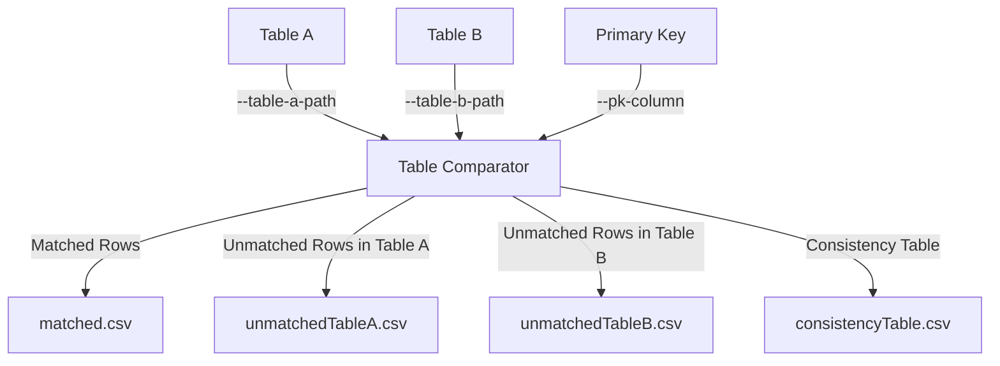
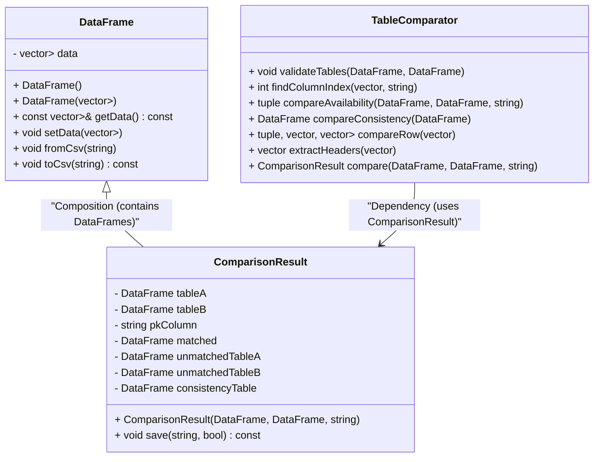

# Table Comparator

## Description
The Table Comparator is a C++ command-line tool designed to compare two CSV tables based on a specified primary key column. It identifies matched rows, unmatched rows, and evaluates the consistency of matched rows across the two tables. The results are saved as CSV files in a specified output directory.

---

## Inputs and Outputs



---

## How to Run

### Command
```bash
./table_comparator --table-a-path <path_to_tableA> --table-b-path <path_to_tableB> --pk-column <primary_key_column> --result-path <output_directory>
```

### Arguments
- `--table-a-path`: Path to the first input CSV file (Table A).
- `--table-b-path`: Path to the second input CSV file (Table B).
- `--pk-column`: Name of the primary key column used for comparison.
- `--result-path`: Path to the directory where the output files will be saved.

### Example
To compare `data/tableA.csv` and `data/tableB.csv` using the `PESEL` column as the primary key and save the results in `data/comparison_result`, run:
```bash
./table_comparator --table-a-path tableA.csv --table-b-path tableB.csv --pk-column PESEL --result-path data/comparison_result
```

---

## Class Diagram



---

## Output Files
- `matched.csv`: Contains rows from both tables that match based on the primary key.
- `unmatchedTableA.csv`: Contains rows from Table A that do not have a match in Table B.
- `unmatchedTableB.csv`: Contains rows from Table B that do not have a match in Table A.
- `consistencyTable.csv`: Contains a detailed comparison of matched rows, including consistency checks for each column.
