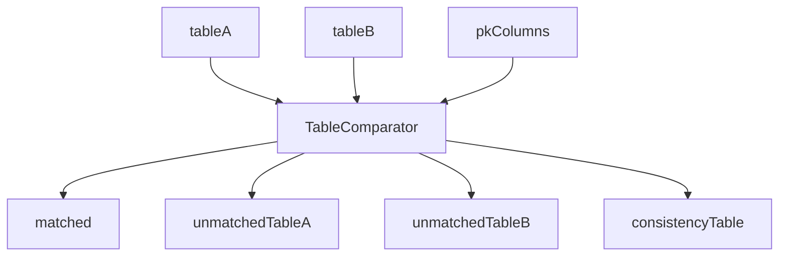
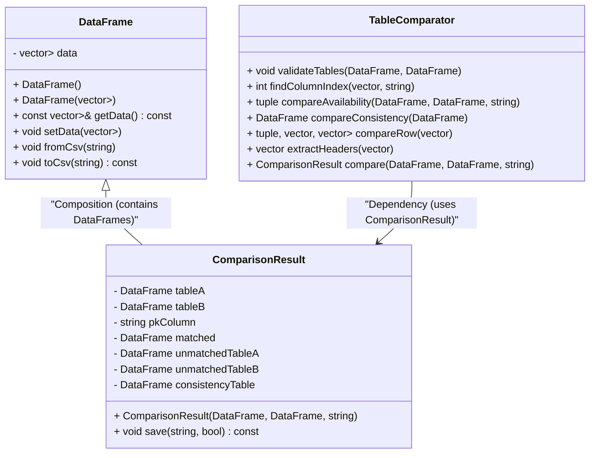

# 🔍 Table Comparator

## 📄 Description
The Table Comparator is a C++ command-line tool designed to compare two CSV tables based on one or more specified primary key columns.  
It identifies matched rows, unmatched rows, and evaluates the consistency of matched rows across the two tables. The results are saved as CSV files in a specified output directory.


- `tableA` and `tableB`: Input DFs to be compared.  
- `pkColumns`: One or more primary key columns used for comparison.  
- `matched`: Contains rows from both tables that match based on the primary key(s).  
- `unmatchedTableA`: Rows from Table A without a match in Table B.  
- `unmatchedTableB`: Rows from Table B without a match in Table A.  
- `consistencyTable`: Detailed comparison of matched rows, checking each column.

## ⚙️ How to Run

### 🖥️ Command
```bash
./table_comparator --table-a-path <path_to_tableA> --table-b-path <path_to_tableB> --pk-column <primary_key_column> [--pk-column <additional_key_column> ...] --result-path <output_directory> [--table-a-separator <separator>] [--table-b-separator <separator>]
```

### 📥 Arguments
- `--table-a-path`: Path to the first input CSV file (Table A).  
- `--table-b-path`: Path to the second input CSV file (Table B).  
- `--pk-column`: Name of one or more primary key columns used for comparison. Multiple columns can be specified by repeating this argument.  
- `--result-path`: Path to the directory where the output files will be saved.  
- `--table-a-separator`: (Optional) Custom separator for Table A (default is `,`).  
- `--table-b-separator`: (Optional) Custom separator for Table B (default is `,`).

## 🔧 Example

### 📂 Input

To compare `tableA.csv` and `tableB.csv` using the `PESEL` and `Nazwisko` columns as composite primary keys, with custom separators (`;` for Table A and `|` for Table B), and save the results in `comparison_result`, run:

```bash
./table_comparator --table-a-path ./data/tableA.csv --table-b-path --table-a-separator ',' --table-b-separator ',' ./data/tableB.csv --pk-column PESEL --pk-column Nazwisko --result-path ./data/comparison_result
```

#### 🧾 tableA.csv
| PESEL        | Imię       | Nazwisko       | Zawód            |
|--------------|------------|----------------|------------------|
| 86485735888  | Jan        | Kowalski       | informatyk       |
| 79073971505  | Tomasz     | Nowak          | przedsiębiorca   |
| 29432533772  | Anna       | Chmielewska    | tancerka         |
| 64188385581  | Barbara    | Romczyk        | urzędniczka      |
| 48395489710  | Andrzej    | Mostkowiak     | mechanik         |
| 23594251784  | Robert     | Tomaszewski    | nauczyciel       |
| 95097548444  | Aneta      | Morawska       | sprzedawczyni    |
| 66488254309  | Aleksander | Tomas          | wykończeniowiec  |

#### 🧾 tableB.csv
| PESEL        | Imię       | Nazwisko       | Zawód            |
|--------------|------------|----------------|------------------|
| 29432533772  | Anna       | Chmielewska    | tancerka         |
| 64188385581  | Barbara    | Kurzewska      | urzędniczka      |
| 48395489710  | Andrzej    | Mostkowiak     | mechanik         |
| 23594251784  | Robert     | Tomaszewski    | nauczyciel       |
| 95097548444  | Aneta      | Morawska       | sprzedawca       |
| 66488254309  | Olek       | Tomas          | wykończeniowiec  |
| 12345678987  | Anna       | Kołodziej      | bezrobotna       |
| 98765432123  | Kacper     | Stawarski      | ogrodnik         |

### 📤 Output

After running the program, you'll find these files in `comparison_result`:

- **📄 unmatchedTableA.csv**
- **📄 unmatchedTableB.csv**
- **📄 consistencyTable.csv**
- **📄 matched.csv**

#### 📄 unmatchedTableA.csv
Rows from `tableA.csv` without matching `PESEL` in `tableB.csv`.

| PESEL        | Imię       | Nazwisko       | Zawód            |
|--------------|------------|----------------|------------------|
| 86485735888  | Jan        | Kowalski       | informatyk       |
| 79073971505  | Tomasz     | Nowak          | przedsiębiorca   |

#### 📄 unmatchedTableB.csv
Rows from `tableB.csv` without matching `PESEL` in `tableA.csv`.

| PESEL        | Imię       | Nazwisko       | Zawód            |
|--------------|------------|----------------|------------------|
| 12345678987  | Anna       | Kołodziej      | bezrobotna       |
| 98765432123  | Kacper     | Stawarski      | ogrodnik         |

#### 📄 consistencyTable.csv
Comparison of matching rows, showing `TRUE`/`FALSE` for each field.

|PESEL      |Imię      |Nazwisko   |Zawód          |
|-----------|----------|-----------|---------------|
|29432533772|Anna      |Chmielewska|tancerka       |
|29432533772|Anna      |Chmielewska|tancerka       |
|TRUE       |TRUE      |TRUE       |TRUE           |
|64188385581|Barbara   |Romczyk    |urzędniczka    |
|64188385581|Barbara   |Kurzewska  |urzędniczka    |
|TRUE       |TRUE      |FALSE      |TRUE           |
|...        |...       |...        |...            |

#### 📄 matched.csv
Joined view of matching rows from both tables.

| PESEL        | Imię       | Nazwisko       | Zawód            | PESEL        | Imię       | Nazwisko       | Zawód            |
|--------------|------------|----------------|------------------|--------------|------------|----------------|------------------|
| 29432533772  | Anna       | Chmielewska    | tancerka         | 29432533772  | Anna       | Chmielewska    | tancerka         |
| 64188385581  | Barbara    | Romczyk        | urzędniczka      | 64188385581  | Barbara    | Kurzewska      | urzędniczka      |
| ...          | ...        | ...            | ...              | ...          | ...        | ...            | ...              |

## 🧩 How It Works

**Table Comparator** uses three core classes:  
- `DataFrame`  
- `ComparisonResult`  
- `TableComparator`



### ✅ Input Validation
- Ensures both tables are:
  - Non-empty  
  - Have matching column counts  
  - Have identical headers  
- Done via `TableComparator::validateTables`.

### 🔑 Composite Primary Key Indexing
- Locates indices of all specified primary key columns using `TableComparator::findColumnIndex`.

### 🔍 Availability Comparison
- Handled by `compareAvailability`:
  - Matches → `matched`  
  - A-only → `unmatchedTableA`  
  - B-only → `unmatchedTableB`  
- Composite keys are generated using all specified primary key columns.

### 🧪 Consistency Check
- `compareConsistency` uses `compareRow` to assess each field.  
- Results go into `consistencyTable`.

### 🔄 Full Comparison
- `compare()` glues all pieces and returns a `ComparisonResult`.

### 💾 Output
- `save()` writes all results to disk in the target output directory.

### 🖥️ Command-Line Usage
- `getopt_long` is used to parse arguments.

### 🚀 Execution Flow
In `main()`:
1. Load CSVs with custom separators.  
2. Compare tables using composite primary keys.  
3. Save results.